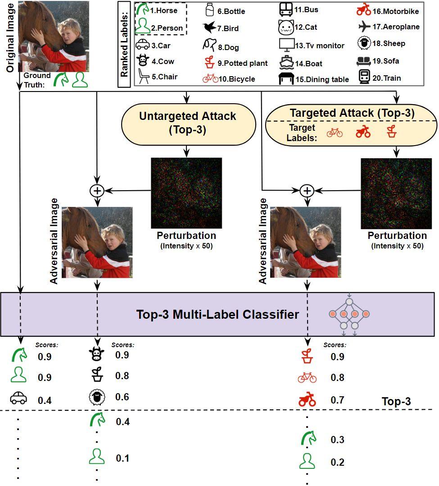

# TkML-AP: Adversarial Attacks To Top-k Multi-Label Learning
[](https://www.python.org/)

Shu Hu, Lipeng Ke, Xin Wang, and Siwei Lyu
_________________

This repository is the official implementation of our paper 
"T$_k$ML-AP: Adversarial Attacks to Top-$k$ Multi-Label Learning", 
which has been accepted by **International Conference on Computer Vision (ICCV) 2021**.
[<a href="http://arxiv.org/abs/2108.00146" target="_blank">PDF</a>] 

<p align="center">
    
</p>

## Notification

Note that if you get the value of 'Pert' from our code, you should use 'Pert'$\cdot$255 to get the final perturbation size. Please refer this [<a href="https://github.com/discovershu/TKML-AP/issues/1#:~:text=We%20use%20the,are%20very%20good." target="_blank">explanation</a>].    

## Requirements

To install requirements:

```setup
pip install -r requirements.txt
```

## How to run the TkML-AP code

### 1. Training of the baseline models(inception_v3 and ResNet)
```test
  $ CUDA_VISIBLE_DEVICES=<cuda-id> python main_attack.py --app train
  ```
  If you do not want to train the model, you can use our pretrained model in google drive with this [link](https://drive.google.com/drive/folders/1e_dxOgxSt7PjbjNFs0LmtVT0KRvhba3x?usp=sharing). 
  
  woSigmoid-BCE-Adam-bs64-box_-1_1 is for PASCAL VOC
  
  woSigmoid-BCE-Adam-bs128-box_-1_1_COCO_fixMem is for COCO
  
  You just need to download our pre-train model and put it under the root of this project. Then you can run our proposed attacking methods and get the results.

### 2. Test the baseline models(inception_v3 and ResNet) and generate test sample index (ap_VOC(COCO)_list.npy)
```test
  $ CUDA_VISIBLE_DEVICES=<cuda-id> python main_attack.py --app test
  ```

### 3. Untargeted attacks

#### - To run TkML-AP-U attack
##### For PACAL VOC 2012
```test
nohup python -u main_attack.py --k_value 3 --app none_target_attack --gpu 0 >none_target_attack_3.log 2>&1 &
nohup python -u main_attack.py --k_value 5 --app none_target_attack --gpu 1 >none_target_attack_5.log 2>&1 &
nohup python -u main_attack.py --k_value 10 --app none_target_attack --gpu 2 >none_target_attack_10.log 2>&1 &
```
##### For MS COCO 2014
```test
nohup python -u main_attack.py --k_value 3 --eps 10 --app none_target_attack --gpu 0 --data data/COCO_2014 --dataset COCO --results woSigmoid-BCE-Adam-bs128-box_-1_1_COCO_fixMem --num_classes 80 --arch resnet50 --image_size 224 >COCO_none_target_attack_3.log 2>&1 & 
nohup python -u main_attack.py --k_value 5 --eps 10 --app none_target_attack --gpu 1 --data data/COCO_2014 --dataset COCO --results woSigmoid-BCE-Adam-bs128-box_-1_1_COCO_fixMem --num_classes 80 --arch resnet50 --image_size 224 >COCO_none_target_attack_5.log 2>&1 &
nohup python -u main_attack.py --k_value 10 --eps 10 --app none_target_attack --gpu 2 --data data/COCO_2014 --dataset COCO --results woSigmoid-BCE-Adam-bs128-box_-1_1_COCO_fixMem --num_classes 80 --arch resnet50 --image_size 224 >COCO_none_target_attack_10.log 2>&1 &
```

#### - To run kFool attack
##### For PACAL VOC 2012
```test
nohup python -u main_attack.py --k_value 3 --app baseline_kfool --gpu 3 >baseline_kfool_3.log 2>&1 &
nohup python -u main_attack.py --k_value 5 --app baseline_kfool --gpu 4 >baseline_kfool_5.log 2>&1 &
nohup python -u main_attack.py --k_value 10 --app baseline_kfool --gpu 5 >baseline_kfool_10.log 2>&1 &
```

##### For MS COCO 2014
```test
nohup python -u main_attack.py --k_value 3 --app baseline_kfool --gpu 3 --data data/COCO_2014 --dataset COCO --results woSigmoid-BCE-Adam-bs128-box_-1_1_COCO_fixMem --num_classes 80 --arch resnet50 --image_size 224 >COCO_baseline_kfool_3.log 2>&1 &
nohup python -u main_attack.py --k_value 5 --app baseline_kfool --gpu 4 --data data/COCO_2014 --dataset COCO --results woSigmoid-BCE-Adam-bs128-box_-1_1_COCO_fixMem --num_classes 80 --arch resnet50 --image_size 224 >COCO_baseline_kfool_5.log 2>&1 &
nohup python -u main_attack.py --k_value 10 --app baseline_kfool --gpu 5 --data data/COCO_2014 --dataset COCO --results woSigmoid-BCE-Adam-bs128-box_-1_1_COCO_fixMem --num_classes 80 --arch resnet50 --image_size 224 >COCO_baseline_kfool_10.log 2>&1 &
```

### 4. Universal untargeted attacks

#### - To run TkML-AP-Uv attack

##### $\xi=0.7$ and $\epsilon=100$, PACAL VOC 2012
```test
nohup python -u main_attack.py --k_value 1 --app UAP_attack --gpu 2 --uap_train_index_end 3000 --uap_test_index_start 3000 --uap_test_index_end 4000  --uap_eps 100 --ufr_lower_bound 0.7 >VOC_TKML_UAP_1_l2_0.7.log 2>&1 &
nohup python -u main_attack.py --k_value 2 --app UAP_attack --gpu 2 --uap_train_index_end 3000 --uap_test_index_start 3000 --uap_test_index_end 4000  --uap_eps 100 --ufr_lower_bound 0.7 >VOC_TKML_UAP_2_l2_0.7.log 2>&1 &
nohup python -u main_attack.py --k_value 3 --app UAP_attack --gpu 2 --uap_train_index_end 3000 --uap_test_index_start 3000 --uap_test_index_end 4000  --uap_eps 100 --ufr_lower_bound 0.7 >VOC_TKML_UAP_3_l2_0.7.log 2>&1 &
```

##### $\xi=0.7$ and $\epsilon=100$, MS COCO 2014
```test
nohup python -u main_attack.py --k_value 1 --app UAP_attack --gpu 1 --uap_train_index_end 3000 --uap_test_index_start 3000 --uap_test_index_end 4000  --uap_norm np.inf --uap_eps 100 --ufr_lower_bound 0.7 --data data/COCO_2014 --dataset COCO --results woSigmoid-BCE-Adam-bs128-box_-1_1_COCO_fixMem --num_classes 80 --arch resnet50 --image_size 224 >TKML_UAP_1_inf_0.7.log 2>&1 &
nohup python -u main_attack.py --k_value 2 --app UAP_attack --gpu 2 --uap_train_index_end 3000 --uap_test_index_start 3000 --uap_test_index_end 4000  --uap_norm np.inf --uap_eps 100 --ufr_lower_bound 0.7 --data data/COCO_2014 --dataset COCO --results woSigmoid-BCE-Adam-bs128-box_-1_1_COCO_fixMem --num_classes 80 --arch resnet50 --image_size 224 >TKML_UAP_2_inf_0.7.log 2>&1 &
nohup python -u main_attack.py --k_value 3 --app UAP_attack --gpu 3 --uap_train_index_end 3000 --uap_test_index_start 3000 --uap_test_index_end 4000  --uap_norm np.inf --uap_eps 100 --ufr_lower_bound 0.7 --data data/COCO_2014 --dataset COCO --results woSigmoid-BCE-Adam-bs128-box_-1_1_COCO_fixMem --num_classes 80 --arch resnet50 --image_size 224 >TKML_UAP_3_inf_0.7.log 2>&1 &
```

#### - To run kUAPs attack
##### $\xi=0.7$ and $\epsilon=100$, PACAL VOC 2012
```test
nohup python -u main_attack.py --k_value 1 --app baseline_kUAP --gpu 9 --uap_train_index_end 3000 --uap_test_index_start 3000 --uap_test_index_end 4000  --uap_eps 100 --ufr_lower_bound 0.7 >VOC_baseline_kUAP_1_l2_0.7.log 2>&1 &
nohup python -u main_attack.py --k_value 2 --app baseline_kUAP --gpu 8 --uap_train_index_end 3000 --uap_test_index_start 3000 --uap_test_index_end 4000  --uap_eps 100 --ufr_lower_bound 0.7 >VOC_baseline_kUAP_2_l2_0.7.log 2>&1 &
nohup python -u main_attack.py --k_value 3 --app baseline_kUAP --gpu 7 --uap_train_index_end 3000 --uap_test_index_start 3000 --uap_test_index_end 4000  --uap_eps 100 --ufr_lower_bound 0.7 >VOC_baseline_kUAP_3_l2_0.7.log 2>&1 &
```

##### $\xi=0.7$ and $\epsilon=100$, MS COCO 2014
```test
nohup python -u main_attack.py --k_value 1 --app UAP_attack --gpu 1 --uap_train_index_end 3000 --uap_test_index_start 3000 --uap_test_index_end 4000  --uap_eps 100 --ufr_lower_bound 0.7 --data data/COCO_2014 --dataset COCO --results woSigmoid-BCE-Adam-bs128-box_-1_1_COCO_fixMem --num_classes 80 --arch resnet50 --image_size 224 >COCO_TKML_UAP_1_l2_0.7.log 2>&1 &
nohup python -u main_attack.py --k_value 2 --app UAP_attack --gpu 1 --uap_train_index_end 3000 --uap_test_index_start 3000 --uap_test_index_end 4000  --uap_eps 100 --ufr_lower_bound 0.7 --data data/COCO_2014 --dataset COCO --results woSigmoid-BCE-Adam-bs128-box_-1_1_COCO_fixMem --num_classes 80 --arch resnet50 --image_size 224 >COCO_TKML_UAP_2_l2_0.7.log 2>&1 &
nohup python -u main_attack.py --k_value 3 --app UAP_attack --gpu 4 --uap_train_index_end 3000 --uap_test_index_start 3000 --uap_test_index_end 4000  --uap_eps 100 --ufr_lower_bound 0.7 --data data/COCO_2014 --dataset COCO --results woSigmoid-BCE-Adam-bs128-box_-1_1_COCO_fixMem --num_classes 80 --arch resnet50 --image_size 224 >COCO_TKML_UAP_3_l2_0.7.log 2>&1 &
```

### 5. Targeted attacks

#### - To run TkML-AP-T attack
#####  Best (PACAL VOC 2012)
```test
nohup python -u main_attack.py --k_value 3 --eps 3 --app target_attack --gpu 0 --label_difficult 'best' --remove_tier_para 0 >VOC_target_best_3_eps_3.log 2>&1 & 
nohup python -u main_attack.py --k_value 5 --eps 3 --app target_attack --gpu 0 --label_difficult 'best' --remove_tier_para 0 > VOC_target_best_5_eps_3.log 2>&1 &
nohup python -u main_attack.py --k_value 10 --eps 3 --app target_attack --gpu 0 --label_difficult 'best' --remove_tier_para 0 > VOC_target_best_10_eps_3.log 2>&1 &
```

#####  Best (MS COCO 2014)
```test
nohup python -u main_attack.py --k_value 3 --eps 3 --app target_attack --gpu 9 --label_difficult 'best' --data data/COCO_2014 --dataset COCO --results woSigmoid-BCE-Adam-bs128-box_-1_1_COCO_fixMem --num_classes 80 --arch resnet50 --image_size 224 --remove_tier_para 0 >COCO_target_best_3_eps_3.log 2>&1 & 
nohup python -u main_attack.py --k_value 5 --eps 3 --app target_attack --gpu 9 --label_difficult 'best' --data data/COCO_2014 --dataset COCO --results woSigmoid-BCE-Adam-bs128-box_-1_1_COCO_fixMem --num_classes 80 --arch resnet50 --image_size 224 --remove_tier_para 0 > COCO_target_best_5_eps_3.log 2>&1 &
nohup python -u main_attack.py --k_value 10 --eps 3 --app target_attack --gpu 9 --label_difficult 'best' --data data/COCO_2014 --dataset COCO --results woSigmoid-BCE-Adam-bs128-box_-1_1_COCO_fixMem --num_classes 80 --arch resnet50 --image_size 224 --remove_tier_para 0 > COCO_target_best_10_eps_3.log 2>&1 &
```

#####  Random (PACAL VOC 2012)
```test
nohup python -u main_attack.py --k_value 3 --eps 3 --app target_attack --gpu 6 --label_difficult 'random' --remove_tier_para 0 > VOC_target_random_3_eps_3.log 2>&1 &
nohup python -u main_attack.py --k_value 5 --eps 3 --app target_attack --gpu 6 --label_difficult 'random' --remove_tier_para 0 > VOC_target_random_5_eps_3.log 2>&1 &
nohup python -u main_attack.py --k_value 10 --eps 3 --app target_attack --gpu 6 --label_difficult 'random' --remove_tier_para 0 > VOC_target_random_10_eps_3.log 2>&1 &
```

#####  Random (MS COCO 2014)
```test
nohup python -u main_attack.py --k_value 3 --eps 3 --app target_attack --gpu 8 --label_difficult 'random' --data data/COCO_2014 --dataset COCO --results woSigmoid-BCE-Adam-bs128-box_-1_1_COCO_fixMem --num_classes 80 --arch resnet50 --image_size 224 --remove_tier_para 0 > COCO_target_random_3_eps_3.log 2>&1 &
nohup python -u main_attack.py --k_value 5 --eps 3 --app target_attack --gpu 8 --label_difficult 'random' --data data/COCO_2014 --dataset COCO --results woSigmoid-BCE-Adam-bs128-box_-1_1_COCO_fixMem --num_classes 80 --arch resnet50 --image_size 224 --remove_tier_para 0 > COCO_target_random_5_eps_3.log 2>&1 &
nohup python -u main_attack.py --k_value 10 --eps 3 --app target_attack --gpu 8 --label_difficult 'random' --data data/COCO_2014 --dataset COCO --results woSigmoid-BCE-Adam-bs128-box_-1_1_COCO_fixMem --num_classes 80 --arch resnet50 --image_size 224 --remove_tier_para 0 > COCO_target_random_10_eps_3.log 2>&1 &
```


#####  Worst (PACAL VOC 2012)
```test
nohup python -u main_attack.py --k_value 3 --eps 3 --app target_attack --gpu 7 --label_difficult 'worst' --remove_tier_para 0 > VOC_target_worst_3_eps_3.log 2>&1 &
nohup python -u main_attack.py --k_value 5 --eps 3 --app target_attack --gpu 7 --label_difficult 'worst' --remove_tier_para 0 > VOC_target_worst_5_eps_3.log 2>&1 &
nohup python -u main_attack.py --k_value 10 --eps 3 --app target_attack --gpu 7 --label_difficult 'worst' --remove_tier_para 0 > VOC_target_worst_10_eps_3.log 2>&1 &
```

#####  Worst (MS COCO 2014)
```test
nohup python -u main_attack.py --k_value 3 --eps 3 --app target_attack --gpu 7 --label_difficult 'worst' --data data/COCO_2014 --dataset COCO --results woSigmoid-BCE-Adam-bs128-box_-1_1_COCO_fixMem --num_classes 80 --arch resnet50 --image_size 224 --remove_tier_para 0 > COCO_target_worst_3_eps_3.log 2>&1 &
nohup python -u main_attack.py --k_value 5 --eps 3 --app target_attack --gpu 7 --label_difficult 'worst' --data data/COCO_2014 --dataset COCO --results woSigmoid-BCE-Adam-bs128-box_-1_1_COCO_fixMem --num_classes 80 --arch resnet50 --image_size 224 --remove_tier_para 0 > COCO_target_worst_5_eps_3.log 2>&1 &
nohup python -u main_attack.py --k_value 10 --eps 3 --app target_attack --gpu 7 --label_difficult 'worst' --data data/COCO_2014 --dataset COCO --results woSigmoid-BCE-Adam-bs128-box_-1_1_COCO_fixMem --num_classes 80 --arch resnet50 --image_size 224  --remove_tier_para 0 > COCO_target_worst_10_eps_3.log 2>&1 &
```

#### - To run ML-AP attack
#####  Best (PACAL VOC 2012)
```test
nohup python -u main_attack.py --k_value 3 --eps 10 --app baseline_rank --gpu 6 --label_difficult 'best' > baseline_best_3_eps_3.log 2>&1 &
nohup python -u main_attack.py --k_value 5 --eps 10 --app baseline_rank --gpu 6 --label_difficult 'best' > baseline_best_5_eps_3.log 2>&1 &
nohup python -u main_attack.py --k_value 10 --eps 10 --app baseline_rank --gpu 6 --label_difficult 'best' > baseline_best_10_eps_3.log 2>&1 &
```

#####  Best (MS COCO 2014)
```test
nohup python -u main_attack.py --k_value 3 --eps 3 --app baseline_rank --gpu 6 --label_difficult 'best' --data data/COCO_2014 --dataset COCO --results woSigmoid-BCE-Adam-bs128-box_-1_1_COCO_fixMem --num_classes 80 --arch resnet50 --image_size 224  > COCO_baseline_best_3_eps_3.log 2>&1 &
nohup python -u main_attack.py --k_value 5 --eps 3 --app baseline_rank --gpu 6 --label_difficult 'best' --data data/COCO_2014 --dataset COCO --results woSigmoid-BCE-Adam-bs128-box_-1_1_COCO_fixMem --num_classes 80 --arch resnet50 --image_size 224  > COCO_baseline_best_5_eps_3.log 2>&1 &
nohup python -u main_attack.py --k_value 10 --eps 3 --app baseline_rank --gpu 6 --label_difficult 'best' --data data/COCO_2014 --dataset COCO --results woSigmoid-BCE-Adam-bs128-box_-1_1_COCO_fixMem --num_classes 80 --arch resnet50 --image_size 224 > COCO_baseline_best_10_eps_3.log 2>&1 &
```

#####  Random (PACAL VOC 2012)
```test
nohup python -u main_attack.py --k_value 3 --eps 10 --app baseline_rank --gpu 5 --label_difficult 'random' > baseline_random_3_eps_3.log 2>&1 &
nohup python -u main_attack.py --k_value 5 --eps 10 --app baseline_rank --gpu 5 --label_difficult 'random' > baseline_random_5_eps_3.log 2>&1 &
nohup python -u main_attack.py --k_value 10 --eps 10 --app baseline_rank --gpu 5 --label_difficult 'random' > baseline_random_10_eps_3.log 2>&1 &
```

#####  Random (MS COCO 2014)
```test
nohup python -u main_attack.py --k_value 3 --eps 3 --app baseline_rank --gpu 5 --label_difficult 'random' --data data/COCO_2014 --dataset COCO --results woSigmoid-BCE-Adam-bs128-box_-1_1_COCO_fixMem --num_classes 80 --arch resnet50 --image_size 224 > COCO_baseline_random_3_eps_3.log 2>&1 &
nohup python -u main_attack.py --k_value 5 --eps 3 --app baseline_rank --gpu 5 --label_difficult 'random' --data data/COCO_2014 --dataset COCO --results woSigmoid-BCE-Adam-bs128-box_-1_1_COCO_fixMem --num_classes 80 --arch resnet50 --image_size 224 > COCO_baseline_random_5_eps_3.log 2>&1 &
nohup python -u main_attack.py --k_value 10 --eps 3 --app baseline_rank --gpu 5 --label_difficult 'random' --data data/COCO_2014 --dataset COCO --results woSigmoid-BCE-Adam-bs128-box_-1_1_COCO_fixMem --num_classes 80 --arch resnet50 --image_size 224 > COCO_baseline_random_10_eps_3.log 2>&1 &
```

#####  Worst (PACAL VOC 2012)
```test
nohup python -u main_attack.py --k_value 3 --eps 10 --app baseline_rank --gpu 4 --label_difficult 'worst' > baseline_worst_3_eps_3.log 2>&1 &
nohup python -u main_attack.py --k_value 5 --eps 10 --app baseline_rank --gpu 4 --label_difficult 'worst' > baseline_worst_5_eps_3.log 2>&1 &
nohup python -u main_attack.py --k_value 10 --eps 10 --app baseline_rank --gpu 4 --label_difficult 'worst' > baseline_worst_10_eps_3.log 2>&1 &
```

#####  Worst (MS COCO 2014)
```test
nohup python -u main_attack.py --k_value 3 --eps 3 --app baseline_rank --gpu 4 --label_difficult 'worst' --data data/COCO_2014 --dataset COCO --results woSigmoid-BCE-Adam-bs128-box_-1_1_COCO_fixMem --num_classes 80 --arch resnet50 --image_size 224 > COCO_baseline_worst_3_eps_3.log 2>&1 &
nohup python -u main_attack.py --k_value 5 --eps 3 --app baseline_rank --gpu 4 --label_difficult 'worst' --data data/COCO_2014 --dataset COCO --results woSigmoid-BCE-Adam-bs128-box_-1_1_COCO_fixMem --num_classes 80 --arch resnet50 --image_size 224 > COCO_baseline_worst_5_eps_3.log 2>&1 &
nohup python -u main_attack.py --k_value 10 --eps 3 --app baseline_rank --gpu 4 --label_difficult 'worst' --data data/COCO_2014 --dataset COCO --results woSigmoid-BCE-Adam-bs128-box_-1_1_COCO_fixMem --num_classes 80 --arch resnet50 --image_size 224 > COCO_baseline_worst_10_eps_3.log 2>&1 &
```

## How to plot Figure 2 in our paper
```test
python plot_main_attack.py --app none_target_attack --k_value 3
python plot_main_attack.py --app none_target_attack --k_value 5
python plot_main_attack.py --app none_target_attack --k_value 10
python plot_main_attack.py --app baseline_kfool --k_value 3
python plot_main_attack.py --app baseline_kfool --k_value 5
python plot_main_attack.py --app baseline_kfool --k_value 10
python plot_ua.py
```

## How to plot Figure 3 in our paper
```test
python plot_main_attack_COCO.py --app UAP_attack --k_value 3
python plot_main_attack_COCO.py --app baseline_kUAP --k_value 3
python plot_uap.py
```

## How to plot Figure 4 in our paper
```test
python plot_main_attack.py --app target_attack --k_value 3
python plot_main_attack.py --app target_attack --k_value 5
python plot_main_attack.py --app target_attack --k_value 10
python plot_main_attack.py --app baseline_rank --k_value 3
python plot_main_attack.py --app baseline_rank --k_value 5
python plot_main_attack.py --app baseline_rank --k_value 10
python plot_ta.py
```

## Citation
Please kindly consider citing our paper in your publications. 
```bash
@article{hu2021tkmlap,
  title={TkML-AP: Adversarial Attacks To Top-k Multi-Label Learning},
  author={Hu, Shu and Ke, Lipeng and Wang Xin and Lyu, Siwei},
  journal={Proceedings of the IEEE International Conference on Computer Vision},
  year={2021}
}
```
